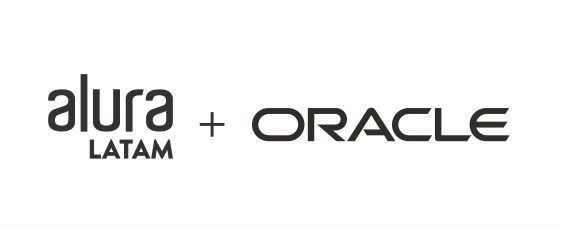

# JAVA SDK 17 + Intellij IDEA

## Challenge Conversor de Monedas G6 One

### Profesores: Bruno Darío Fernández Ellerbach / Genesys Rondon

  

### Características del Reto

| Item | Descripción | Observación |
| ---- | ------------ | ------------ |
| 1    |              |              |
| 2    |              |              |
| 3    |              |              |
| 4    |              |              |
|      |              |              |

### Tecnologias utilizadas

